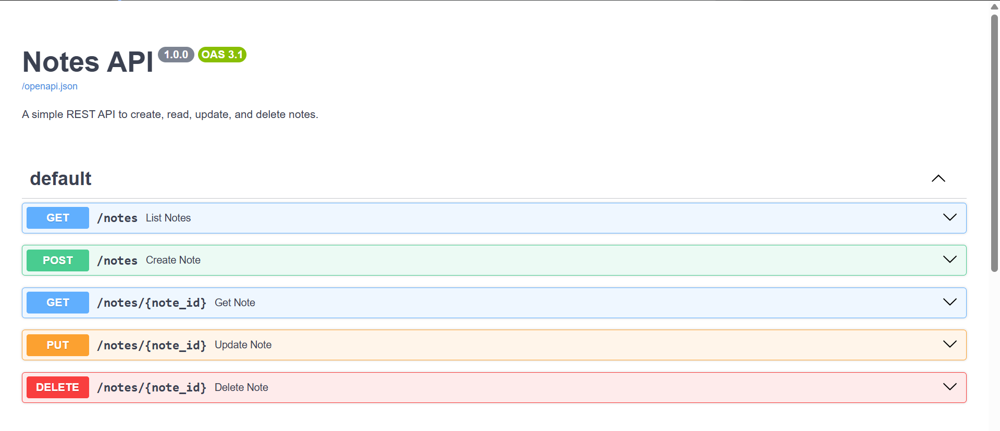
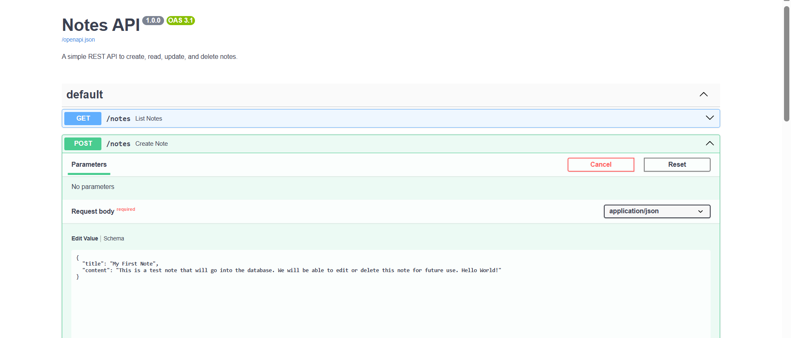
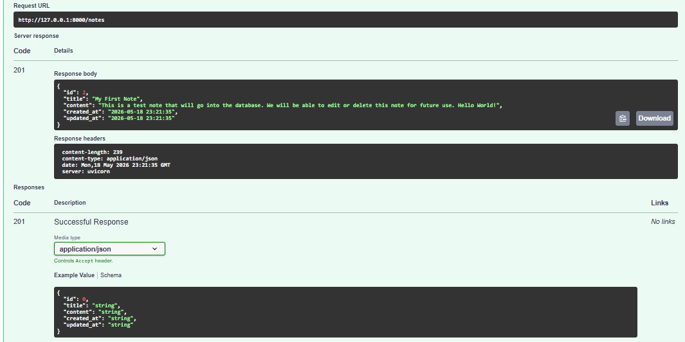
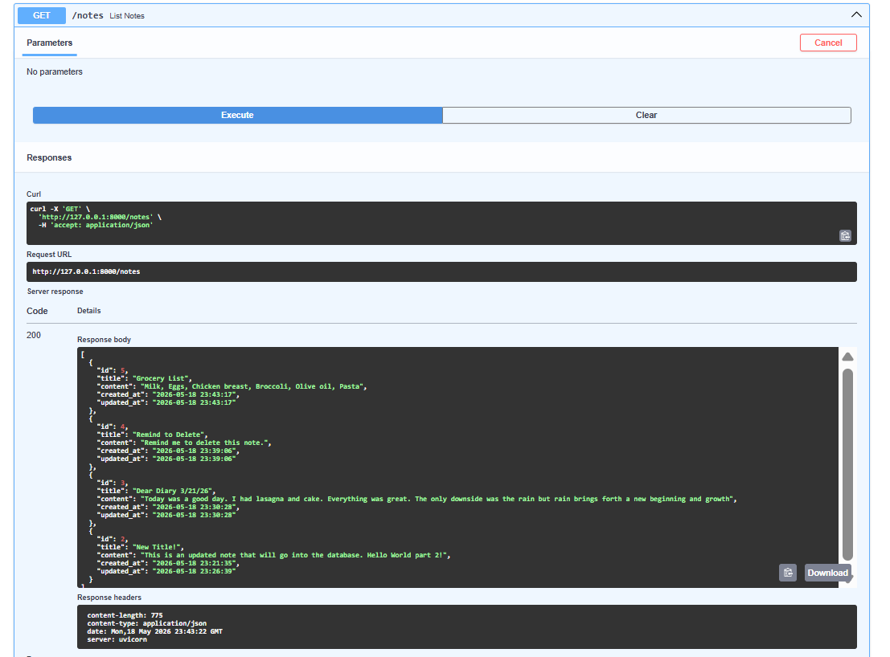
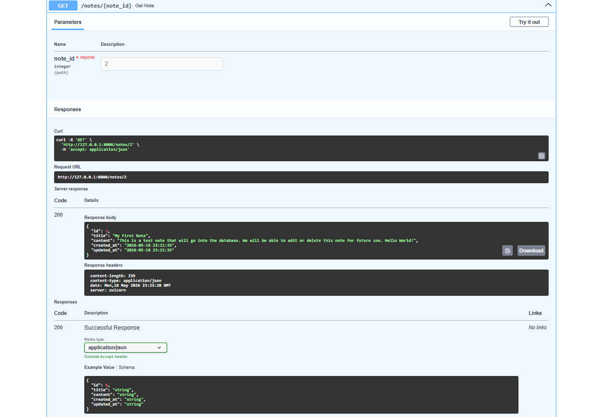
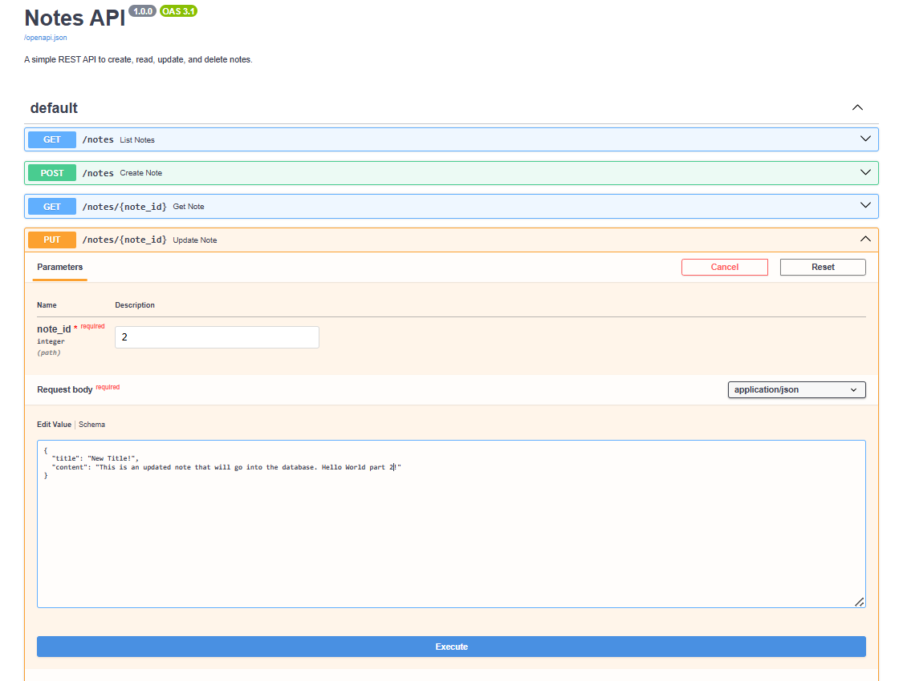
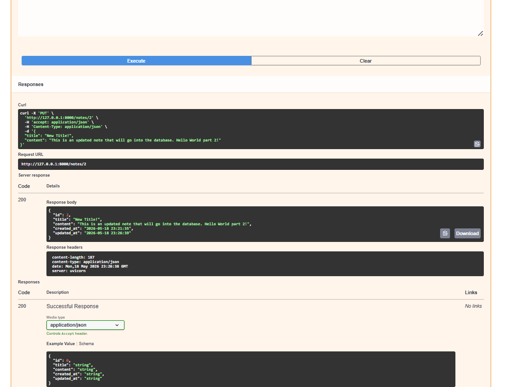
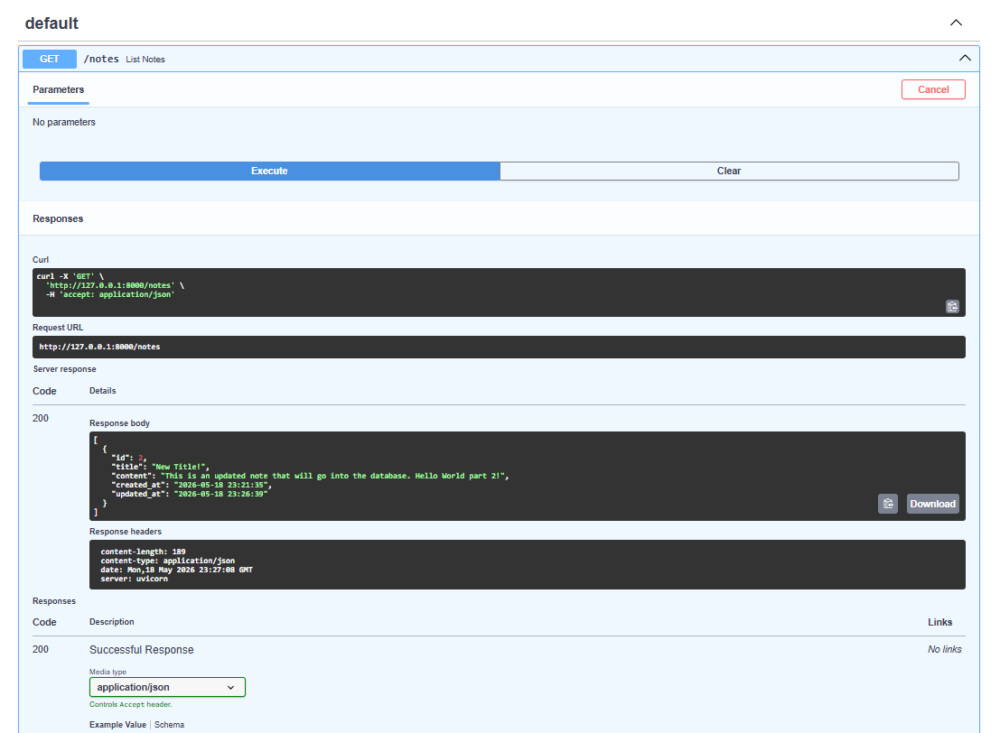
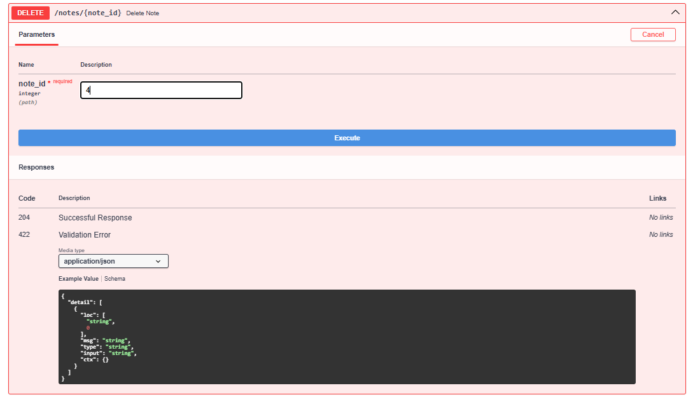
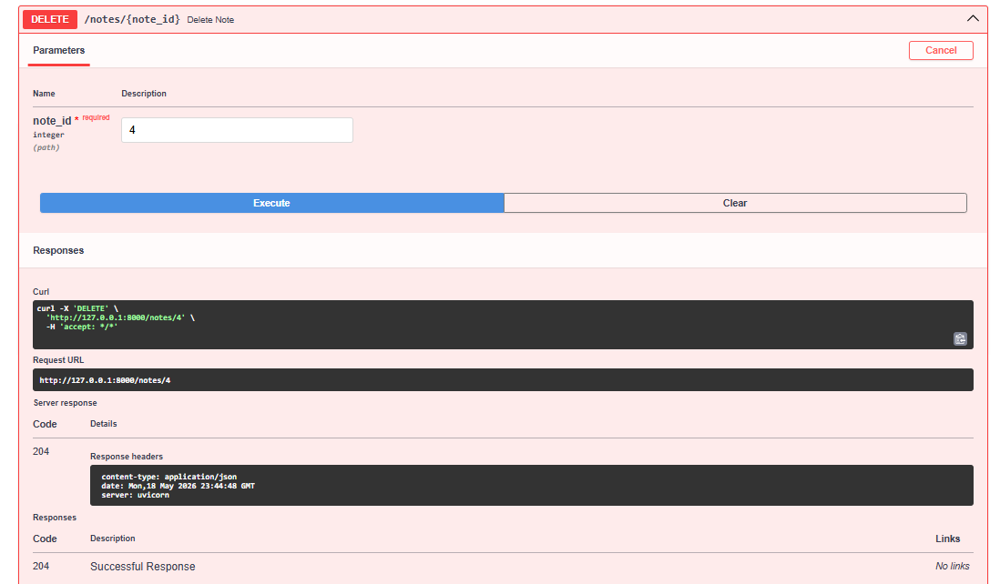

# Notes API

A RESTful API for creating, reading, updating, and deleting notes. Built with FastAPI and SQLite.

 

## Tech Stack
- Python 3.x
- FastAPI
- SQLite (Python's built-in `sqlite3`)
- Pydantic
- Uvicorn

## Setup

```bash
git clone https://github.com/YOUR-USERNAME/fastapi-notes.git
cd fastapi-notes
python -m venv venv
venv\Scripts\activate
pip install -r requirements.txt
```

## Run

```bash
uvicorn main:app --reload
```

Open `http://127.0.0.1:8000/docs` for the interactive API docs.

## Endpoints

| Method | Endpoint | Description |
|--------|----------|-------------|
| POST | `/notes` | Create a new note |



| GET | `/notes` | List all notes |


| GET | `/notes/{id}` | Get a single note |


| PUT | `/notes/{id}` | Update a note (partial updates supported) |




| DELETE | `/notes/{id}` | Delete a note |



## Project Structure

```
fastapi-notes/
├── main.py        # API routes and endpoint logic
├── database.py    # SQLite connection and table setup
├── schemas.py     # Pydantic models for request/response validation
├── requirements.txt
└── README.md
```